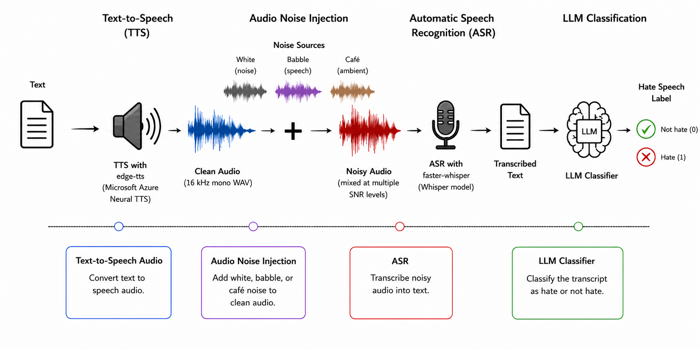

# LLM Classification Performance Under Text Noise

This repository provides the data generation and evaluation pipeline for:

> Y. Zhao, A. Abdi, "Interpretability of LLM Classifiers via the Rational Inattention Theory with Application to Hate Speech Detection," *ACL Student Research Workshop*, 2026.

The pipeline classifies hate-speech texts at 11 noise levels (p′ = 0.0 to 1.0) using GPT and/or Gemini, computes the full conditional probability matrix (P1a, P1b, P2a, P2b, Pc, I(Y;A)), and fits the extended Rational Inattention (RI) model to estimate the interpretability parameters x = r/λ per LLM and the shared noise-mapping parameters α, β.

---

## Requirements

```bash
pip install datasets pandas numpy scipy matplotlib openai google-genai python-dotenv tqdm
```

Create a `.env` file in the project root:

```
OPENAI_API_KEY=sk-...
GEMINI_API_KEY=AIza...
GITHUB_TOKEN=ghp_...
```

`.env` is listed in `.gitignore` and will never be committed.

---

## Scripts

| Script | Description |
|---|---|
| `download_data.py` | Downloads the dataset from Hugging Face and creates a balanced sample |
| `add_text_noise.py` | Generates 11 noisy versions of the sample at noise levels p′ = 0.0 to 1.0 |
| `get_llm_responses.py` | Sends each text individually to GPT and/or Gemini for binary hate-speech classification |
| `compute_metrics.py` | Computes the full conditional probability matrix and I(Y;A) across noise levels |
| `fit_ri_model.py` | Runs the NIAS test and fits the extended RI model jointly across all LLMs |

---

## How to Run

### 1. Download the dataset

```bash
python download_data.py                    # default: 200 per class (400 total)
python download_data.py --sample-size 500  # 500 per class (1000 total)
```

Downloads `ucberkeley-dlab/measuring-hate-speech` from Hugging Face and samples N clearly-benign texts (hate\_speech\_score < −3, label = 0) and N clearly-hateful texts (score > 3, label = 1), keeping only unique texts.

**Output:**
```
Dataset/hate_speech_binary.csv            # full dataset (~136k rows)
Dataset/hate_speech_binary_{2N}.csv       # balanced 2N-sample
```

---

### 2. Data Pipeline

The dataset is constructed through a four-stage audio noise pipeline that converts raw text into acoustically degraded transcriptions for LLM classification.



#### Stage 1 — Text-to-Speech (TTS)

Each source text is synthesised into speech using **`edge-tts`** (Microsoft Azure Neural TTS, voice: `en-US-GuyNeural`), then decoded and resampled to **16 kHz mono WAV** via PyAV.

```bash
python pipeline/add_audio_noise.py --step tts
```

Output: `Dataset/audio_original/{id}.wav`

#### Stage 2 — Acoustic Noise Injection

Clean speech is mixed with noise at **21 controlled SNR levels** (40 dB to −20 dB) using RMS-power-normalised mixing. Three noise types are used:

| Noise type | Source |
|---|---|
| White | Synthetic i.i.d. Gaussian (NumPy) |
| Babble | MUSAN corpus — 15 speakers overlaid (Snyder et al., 2015; OpenSLR 17) |
| Café | DEMAND `CAFE_16k` — real cafeteria ambience (Thiemann et al., 2013; Zenodo 1227121) |

```bash
python pipeline/download_noise.py                # ~400 MB, one-time
python pipeline/add_audio_noise.py --step mix
```

Output: `Dataset/audio_noisy/{noise_type}/snr_{label}/{id}.wav`

#### Stage 3 — Automatic Speech Recognition (ASR)

Each noisy WAV is transcribed using **`faster-whisper`** (SYSTRAN CTranslate2 port of OpenAI Whisper `base`, 74 M parameters; CPU, int8 quantised, beam\_size=5, language=en). The transcribed text replaces the original text column.

```bash
python pipeline/add_audio_noise.py --step asr
```

Output: `Dataset/text_with_audio_noisy/{noise_type}/hate_speech_{N}_{snr_label}.csv`

#### Stage 4 — LLM Classification

Transcribed texts are classified by four commercial LLMs (GPT-3.5-turbo, GPT-5.4-nano, Gemini-2.5-Flash, Gemini-2.5-Flash-Lite) using a zero-shot binary hate-speech prompt (see [Step 3](#3-get-llm-responses)).

**Install additional dependencies for the audio pipeline:**
```bash
pip install edge-tts av torchaudio faster-whisper tqdm
```

---

### 3. Get LLM responses

```bash
python get_llm_responses.py --model gpt
python get_llm_responses.py --model gemini
python get_llm_responses.py --model both

# Specify a different model via CLI (no need to edit the script):
python get_llm_responses.py --model gpt    --gpt-model    gpt-5.4-nano
python get_llm_responses.py --model gemini --gemini-model gemini-2.5-flash-lite
```

Each text is sent as an **individual API call** (no batching) to avoid cross-item influence. Calls are parallelised with `ThreadPoolExecutor` (10 workers by default). Failed calls are retried up to 3 times with exponential back-off on rate-limit errors. Already-processed files are skipped, so it is safe to resume after interruption.

Default models (set in the CONFIG block of `get_llm_responses.py`):
```python
GPT_MODEL    = "gpt-3.5-turbo"
GEMINI_MODEL = "gemini-2.5-flash"
```

**Output:**
```
Dataset/results/gpt_{tag}/hate_speech_{N}_p_00.csv       # + column pred_gpt_*
...
Dataset/results/gemini_{tag}/hate_speech_{N}_p_00.csv    # + column pred_gemini_*
```

---

### 4. Compute summary statistics

```bash
python compute_metrics.py --model gpt
python compute_metrics.py --model gemini
python compute_metrics.py --model both

# For a non-default model:
python compute_metrics.py --model gpt    --gpt-model    gpt-5.4-nano
python compute_metrics.py --model gemini --gemini-model gemini-2.5-flash-lite
```

Computes the full conditional probability matrix per noise level. Notation follows the channel diagram in the paper (state index × action index):

| Metric | Definition |
|---|---|
| **P1a** | P(action=a \| state=1) = P(pred=NoHate \| True=NoHate) — specificity |
| **P1b** | P(action=b \| state=1) = P(pred=Hate \| True=NoHate) — false-positive rate |
| **P2a** | P(action=a \| state=2) = P(pred=NoHate \| True=Hate) — false-negative rate |
| **P2b** | P(action=b \| state=2) = P(pred=Hate \| True=Hate) — sensitivity |
| **Pc** | Accuracy — P(S=2)·P2b + P(S=1)·P1a |
| **I(Y;A)** | Mutual information between ground truth and prediction (nats) |

**Output:**
```
Dataset/results/gpt_{tag}/summary_gpt_{tag}.csv
Dataset/results/gemini_{tag}/summary_gemini_{tag}.csv
```

---

### 5. Fit the RI model and run NIAS test

```bash
python fit_ri_model.py
```

Implements Sections 4.2 and 4.3 of the paper. The `MODELS` list in the CONFIG block controls which models are included in the joint fit:

```python
MODELS = [
    ("GPT-3.5-turbo",         "gpt_gpt_3_5_turbo"),
    ("GPT-5.4-nano",          "gpt_gpt_5_4_nano"),
    ("Gemini-2.5-Flash",      "gemini_gemini_2_5_flash"),
    ("Gemini-2.5-Flash-Lite", "gemini_gemini_2_5_flash_lite"),
]
```

**NIAS test (Eq. 9):** verifies that each LLM's decision strategy is consistent with rational inattention by checking the No Improving Action Switches condition across all noise environments:

$$P(A=a \mid Y=1) \geq \frac{P(A=a \mid Y=2) + 2}{3}$$

**RI model fitting (Eq. 12):** estimates parameters by minimising joint SSE between predicted and observed Pc across all LLMs simultaneously:

| Parameter | Meaning | Scope |
|---|---|---|
| **x = r/λ** | Reward-to-cost ratio | Per LLM |
| **λ = 1/x** | Unit information cost (with r = 1) | Per LLM |
| **α** | Scale of noise mapping q(p′) = min(α·p′^β, 1) | Shared across all LLMs |
| **β** | Shape (convexity) of noise mapping | Shared across all LLMs |

α and β are shared because all LLMs receive the exact same noisy texts — the noise process is an objective property of the channel, not of the model. A value of β > 1 implies a convex mapping: noise degrades the channel slowly at low p′ and accelerates at high p′.

**Output:**
```
Dataset/results/ri_fit/fitted_params.csv       # x, lambda, alpha, beta, R² per model
Dataset/results/ri_fit/shared_noise_params.csv # alpha, beta, q(p') at each noise level
Dataset/results/ri_fit/nias_test.csv           # NIAS condition and p-value per noise level
Dataset/results/ri_fit/<model>_fit.png         # observed vs fitted Pc per model
Dataset/results/ri_fit/all_models_fit.png      # all models overlaid
```

---

## Output folder structure

```
Dataset/
├── hate_speech_binary.csv                    # full dataset
├── hate_speech_binary_{N}.csv                # balanced N-sample
├── text_noise/
│   ├── hate_speech_{N}_p_00.csv             # clean
│   ├── hate_speech_{N}_p_01.csv
│   └── ...
└── results/
    ├── gpt_gpt_3_5_turbo/
    │   ├── hate_speech_{N}_p_00.csv
    │   ├── ...
    │   └── summary_gpt_gpt_3_5_turbo.csv
    ├── gpt_gpt_5_4_nano/
    │   └── ...
    ├── gemini_gemini_2_5_flash/
    │   └── ...
    ├── gemini_gemini_2_5_flash_lite/
    │   └── ...
    └── ri_fit/
        ├── fitted_params.csv
        ├── shared_noise_params.csv
        ├── nias_test.csv
        ├── GPT3.5turbo_fit.png
        ├── GPT5.4nano_fit.png
        ├── Gemini2.5Flash_fit.png
        ├── Gemini2.5FlashLite_fit.png
        └── all_models_fit.png
```

---

## Dataset

The base dataset is [ucberkeley-dlab/measuring-hate-speech](https://huggingface.co/datasets/ucberkeley-dlab/measuring-hate-speech) (Kennedy et al., 2020), available from Hugging Face. No redistribution of the raw data is included in this repository.

## Citation

If you use this repository, including the text-noise generation pipeline, LLM classification evaluation scripts, conditional probability metrics, NIAS test, or Rational Inattention model-fitting code, please cite the following paper:

```bibtex
@inproceedings{zhao-abdi-2026-interpretability,
  title = {Interpretability of {LLM} Classifiers via the Rational Inattention Theory with Application to Hate Speech Detection},
  author = {Zhao, Yuan and Abdi, Ali},
  editor = {T.Y.S.S., Santosh and Rodriguez, Juan Diego and de Gibert, Ona},
  booktitle = {Proceedings of the 64th Annual Meeting of the Association for Computational Linguistics (Volume 4: Student Research Workshop)},
  month = jul,
  year = {2026},
  address = {San Diego, California, United States},
  publisher = {Association for Computational Linguistics},
  pages = {281--289},
  doi = {10.18653/v1/2026.acl-srw.23},
  url = {https://aclanthology.org/2026.acl-srw.23/},
  isbn = {979-8-89176-393-7}
}
```

This repository implements the experimental pipeline described in the paper, including hate-speech data preprocessing, controlled text-noise generation, LLM response collection, performance-metric computation, NIAS testing, and extended Rational Inattention model fitting.

